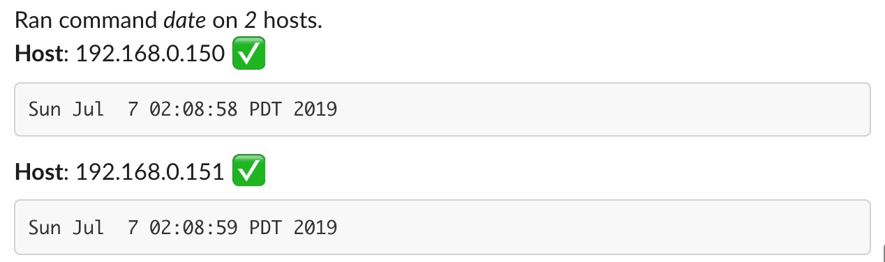

.. _action_aliases:

****************
Action Aliases
****************

.. note:: This section assumes you have little to no familiarity with Stackstorm. If that's not the case, you may skip it.

Overview
---------

`Action Aliases <https://docs.stackstorm.com/chatops/aliases.html>`_ is a Stackstorm feature that helps *exposing actions to the bot*. Their main purpose is to provide a *simple human readable* representation of actions, very useful in text-based interfaces, notable ChatOps.

Generally speaking, you can expose any action to the bot. You can list them using `st2 action-alias list`.

Creating a simple action alias
-------------------------------

Let's create a simple action alias to demonstrate `err-stackstorm`. Aliases are deployed via packs so let's create one quickly::

  mkdir -p /<st2path>/packs/errtest/aliases

Create a file inside the ``aliases`` folder named ``run_remote.yaml`` and paste the yaml defined below:

.. code-block:: yaml

    ---
    name: "local_shell_cmd"
    action_ref: "core.local"
    description: "Execute a command on a remote host via SSH."
    formats:
      - "run {{cmd}}"
    result:
      format: "operation completed {~} {{ execution.result }}"

After that, ask Stackstorm to reload its configuration::

  st2ctl reload --register-all

.. note:: Errbot will automatically refresh its action alias list when you add or remove aliases on Stackstorm. Type ``!st2help`` to your bot on the chat to list available StackStorm commands.

In this example ``local_shell_cmd`` is an alias for the ``core.local`` action. If you want to run a command against a remote host, you could have used the ``core.remote`` action.

The supported format for the alias is specified in the formats field. A single alias can support multiple formats for the same action. The result will then be returned to `err-stackstorm` and Errbot will propagate that back to your chat backend.

Usage
------

Once the alias is setup, talk to your bot and type::

  !st2 run date

The bot will answer your request using the ``result.format`` definition::

  operation completed {~} Sun Jul  7 02:08:58 PDT 2019

Advanced Formatting
--------------------

.. seealso:: Don't forget to check ST2's official documentation on `Action Aliases <https://docs.stackstorm.com/chatops/aliases.html>`_.

Here's an example of an Alias that runs a command on a list of remote hosts and outputs the results nicely formatted on **Slack**.

.. code-block:: yaml

    ---
    name: "remote_shell_cmd"
    action_ref: "core.remote"
    description: "Execute a command on a remote host via SSH."
    formats:
      - "run {{cmd}} on {{hosts}}"
    result:
       format: |
          Ran command *{{execution.parameters.cmd}}* on *{{ execution.result | length }}* hosts.

          
          \*Host\*: {{host}} {{ ":white_check_mark:" if execution.result[host].stdout else ":x:" }}
          \`\`\`{{ execution.result[host].stdout or execution.result[host].stderr or "No result"}}\`\`\`
          

The alias above will format the execution output per host once it gathers the results. The sheer amount backticks and escaping are due to particularities between Errbot and Slack - this may not work in another chat backend.

This is how the bot will answer you on Slack:

.. important:: Advanced formatting may not be available to all chat backends since each backend requires specific code to translate ST2's `extra` parameter.
