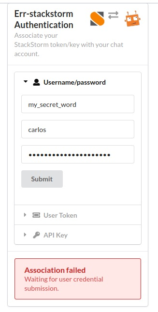

.. _authentication:

***************
Authentication
***************

.. contents:: :local:

.. important:: Do not configure multiple authentication methods at the same time.

Standalone
==========

This is the default authentication method where `err-stackstorm` uses its own credentials for all calls to the StackStorm API.  All action-aliases issued by chat service users execute the underlying workflows with `err-stackstorm` credentials.

Any Role Based Access Control policies can only be applied to the bot user which gives limited control.

Configuration
--------------

An empty dictionary in the `standalone` key is all that is required to maintain err-stackstorm's default authentication method.

.. code-block:: python

    "rbac_auth": {
        "standalone": {}
    }

Client-Side
============

.. note::  This implementation is specific to err-stackstorm.

`err-stackstorm` provides a way to associate the chat service user account with a StackStorm username/password or API token. Once a chat user is associated with their StackStorm credentials, any action-alias will be executed using the associated StackStorm credentials.

This method allows for finer control as StackStorm's Role Based Access Control can be defined per-user.

Chat users create a new authentication session with `err-stackstorm` by calling `session_start` with a secret word, it can be any thing the user wishes.  A `UUID <https://en.wikipedia.org/wiki/Universally_unique_identifier>`_ is generated for the session and the chat user is invited to follow a URL to an authentication page hosted by Errbot.

.. important:: For security reasons, the UUID is used only once and is consumed when the page is accessed.  Any subsequent attempts to access the authentication page using the same link will result in an error.

The login page must be protected by TLS encryption and ideally require an SSL client certificate.  The login page should not be exposed directly to the internet, but have a reverse proxy such as nginx placed between it and any external service consumers.

The user enters their StackStorm credentials via the login page which err-stackstorm will validate against the StackStorm API.  If the credentials are valid, the user token or api key will be cached by err-stackstorm and the supplied credentials discarded.

Configuration
-------------

To configure the Client-Side authentication method, one needs to take steps to setup both Nginx and Errbot. Nginx is used to serve static web content for the authentication web page and Errbot serves as the API backend for authentication calls.

NGINX
^^^^^^

.. note:: This example is provided as a guide only.  You are expected to know and understand how to configure nginx for your environment.  It is outside of the scope of this documentation to go over nginx's configuration and explain SSL certificates.

.. important::  This example does not show how to secure access using SSL certificates.  It is **highly recommended** to use SSL for production environments.

To help understand the example below, the following conditions are assumed:

* the nginx server is running *on the same host* as errbot.
* the host's fully qualified domain name is ``my_host.my_fqdn``.
* nginx listens to standard SSL-enabled port: 443.
* Errbot's webserver listens on the ip address 127.0.0.1 TCP port 3141 without ssl enabled.
* Errbot's plugins directory is /data/errbot/plugins
* `err-stackstorm` is installed in /data/errbot/plugins/nzlosh/err-stackstorm.
* The SSL certificate and private key used by nginx are called errbot.crt and errbot.key.

.. code-block:: nginx

    server {
      listen       my_host.my_fqdn:443 ssl;
      server_name  my_host.my_fqdn;

      ssl on;

      ssl_certificate           /etc/ssl/errbot.crt;
      ssl_certificate_key       /etc/ssl/errbot.key;
      ssl_session_cache         shared:SSL:10m;
      ssl_session_timeout       5m;
      ssl_protocols             TLSv1 TLSv1.1 TLSv1.2;
      ssl_ciphers               EECDH+AESGCM:EDH+AESGCM:AES256+EECDH:AES256+EDH:ECDHE-RSA-AES128-GCM-SHA384:ECDHE-RSA-AES128-GCM-SHA256:ECDHE-RSA-AES128-GCM-SHA128:DHE-RSA-AES128-GCM-SHA384:DHE-RSA-AES128-GCM-SHA256:DHE-RSA-AES128-GCM-SHA128:ECDHE-RSA-AES128-SHA384:ECDHE-RSA-AES128-SHA128:ECDHE-RSA-AES128-SHA:ECDHE-RSA-AES128-SHA:DHE-RSA-AES128-SHA128:DHE-RSA-AES128-SHA128:DHE-RSA-AES128-SHA:DHE-RSA-AES128-SHA:ECDHE-RSA-DES-CBC3-SHA:EDH-RSA-DES-CBC3-SHA:AES128-GCM-SHA384:AES128-GCM-SHA128:AES128-SHA128:AES128-SHA128:AES128-SHA:AES128-SHA:DES-CBC3-SHA:HIGH:!aNULL:!eNULL:!EXPORT:!DES:!MD5:!PSK:!RC4;
      ssl_prefer_server_ciphers on;

      index  index.html index.htm;

      access_log            /var/log/nginx/ssl-errbot.access.log combined;
      error_log             /var/log/nginx/ssl-errbot.error.log;

      add_header              Front-End-Https on;
      add_header              X-Content-Type-Options nosniff;

      location /login/ {
        proxy_pass            http://127.0.0.1:3141$request_uri;
        proxy_read_timeout    90;
        proxy_connect_timeout 90;
        proxy_redirect        off;

        proxy_set_header      Host my_host.my_fqdn;
        proxy_set_header      X-Real-IP $remote_addr;
        proxy_set_header      X-Forwarded-For $proxy_add_x_forwarded_for;

        proxy_set_header Connection '';
        chunked_transfer_encoding off;
        proxy_buffering off;
        proxy_cache off;
        proxy_set_header Host my_host.my_fqdn;
      }

      location / {
        root      /data/errbot/plugins/nzlosh/err-stackstorm/html/;
        index     index.html index.htm;
      }
    }

After successfully setting up nginx, the client side authentication url would be ``https://my_host.my_fqdn:443``.

err-stackstorm configuration
^^^^^^^^^^^^^^^^^^^^^^^^^^^^^

A url is required to correctly configure client-side authentication for ChatOps. This URL is Errbot's authentication endpoint that you have just set up.

.. code-block:: python

    "rbac_auth": {
        "clientside": {
            "url": "https://<hostname>:<port>/"
        }
    },

Authenticating
^^^^^^^^^^^^^^^

Once the client side authentication is setup, you should be able to trigger the authentication process with ``!st2authenticate my_secret_word`` which will return a url to complete the login processes. This is how the page looks like:

